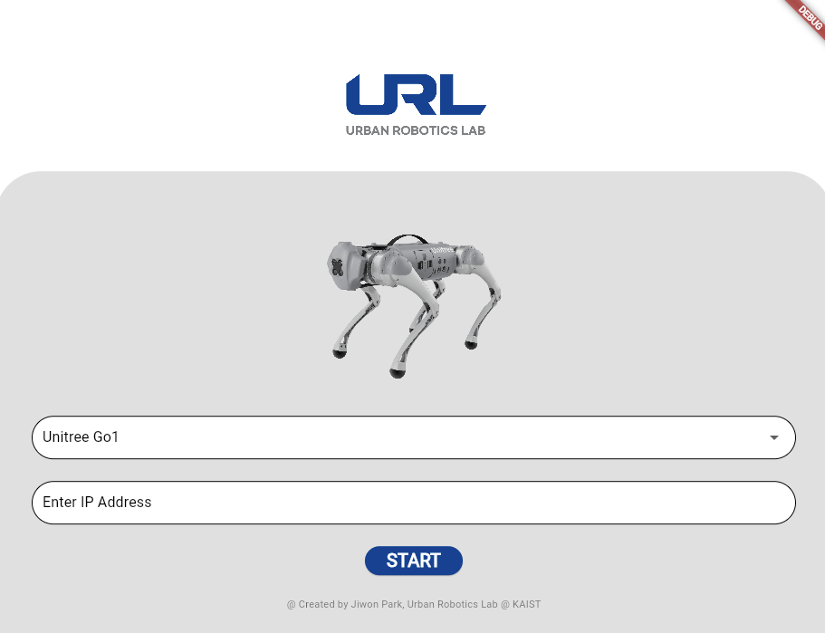
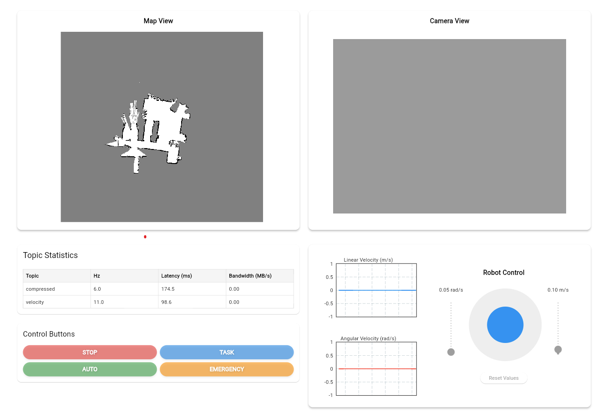

# Webapp for Quadrupted Robot

## Features 

### Functional
- Topic Viewer
    - Image
    - Point Cloud (not yet)
    - Map
- Robot Control
    - Joystick
    - Execute shell script
    - Rosservice
- Commnucation Panel

### Non-functional
- Responsive web
- Traffic management

## Dependency

- Flutter / Dart
- rosbridge_server

## How to run 

- 실행해야 하는 프로세스들
    - ~/ziwon/gui_ws/src/ros_web_app$ flutter run -d chrome # flutter
    - roslaunch rosbridge_server rosbridge_websocket.launch # rosbridge_server
    - ~/ziwon/gui_ws/src/assets/map$ rosrun map_server map_server blank_map_with_obstacle.yaml # map_server
    - roslaunch unitree_gazebo normal.launch rname:=go1 # gazebo
    - dreamwaq
    - roslaunch topic_compressor topic_compressor.launch # not yet

